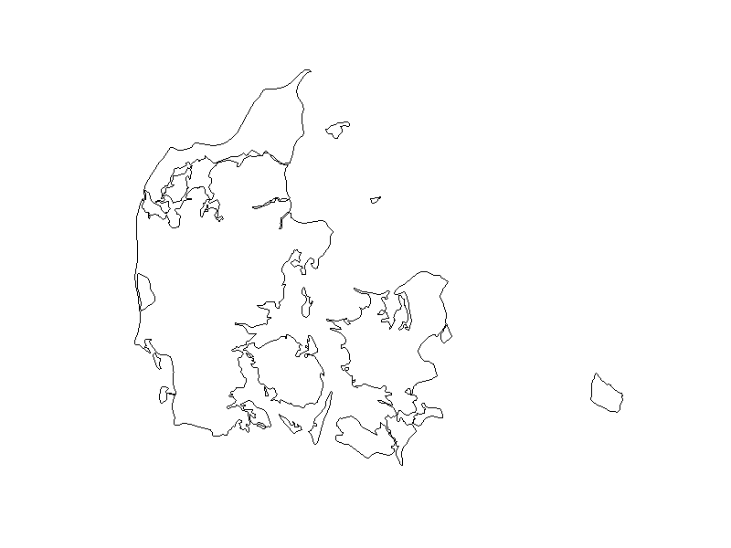
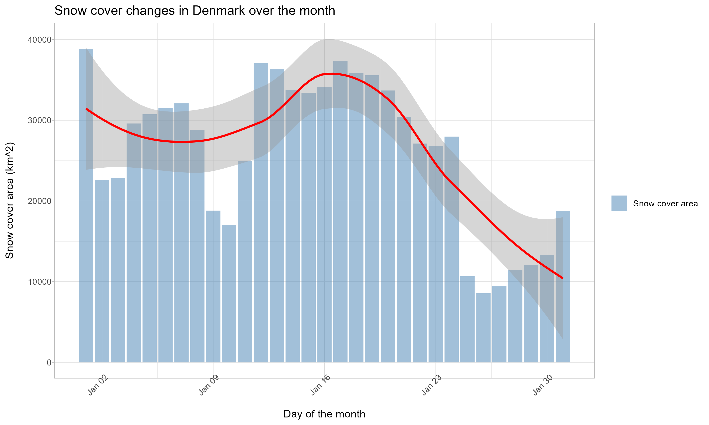
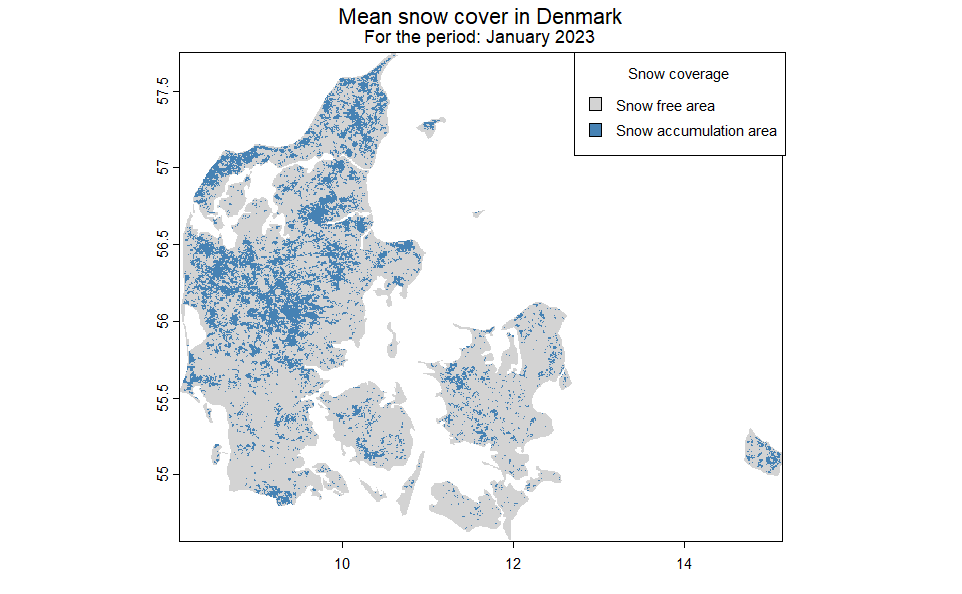
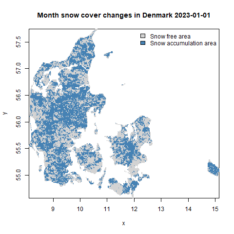

# SnowCover

<!-- badges: start -->
<!-- badges: end -->
Welcome to the SnowCover R package!
This package is designed to help you analyze snow cover data and visualize changes in snow cover over time.

Autor: Daria Ushakova

## Installation

## Installation

You can install the development version of SnowCover from [GitHub](https://github.com) with:

``` r
# install.packages("devtools")
devtools::install_github("Dariaeagle/SnowCover")
library(SnowCover)
```

```

## Usage

- `download_snow_data`: Download daily snow cover images from a specified source.
- `load_country_boundary`: Load the boundary of a specified country for analysis.
- `crop_rasters`: Crop raster images to a specified boundary.
- `binary_mask`: Apply a binary mask to cropped raster images.
- `plot_snow_cover`: Plot snow cover data over time.
- `mean_snow_cover`: Calculate the mean snow cover for a given period.

## Example workflow for SnowCover Package

1. Downloading Snow Cover Data

First of all, you need to download daily snow cover images. These images provided 
in a Global Snow Pack dataset by DLR and can be downloaded using the `download_snow_data` function.


```{r example}
library(SnowCover)

start_date <- as.Date("2023-01-01")
end_date <- as.Date("2023-01-31")
save_dir <- "path/to/save/directory"

download_snow_data(start_date, end_date, save_dir)

```

2. Loading Administrative Boundary Data
After downloading the raster files, load the boundary of a specific country for analysis. The `load_country_boundary` function can be used for this purpose.


```{r example}
# Example code to load administrative boundary data
map <- ne_download(scale = 10, returnclass = "sf")
country_name <- "Denmark" # Set country name
#apply function
country_boundary <- load_country_boundary(map, country_name)
plot(country_boundary)

```

3. Crop Raster Files by Country Boundary

After downloading the raster files, you can use the `crop_rasters` function to crop them based on the boundary of a specific country. The cropped raster files will be saved in the specified output directory.


```{r example}
raster_files <- list.files("path/to/raster/files", pattern = "\\.tif$", full.names = TRUE)
output_dir <- "path/to/output/directory"
crop_rasters(raster_files, country_boundary, output_dir)
```

4. Apply Binary Mask to Cropped Raster Files

To create a binary mask for the cropped raster files, use the `binary_mask` function. This function will create a binary mask for each raster file based on a specified threshold value. All data in Global Snow pack is stored as 8-bit unsigned integers.
The binary mask is created by setting all values below 64 to 0 and all values above or equal to 64 to 1, which corresponds to snow-free and snow-covered areas, respectively.

```{r example}
# Apply binary mask to cropped raster files
clipped <- list.files("path/to/raster/files", pattern = "\\.tif$", full.names = TRUE)
#binary_mask (the raster data of the binary mask)
binary_mask(binary_mask, clipped, "path/to/output/directory")

```

5.Plot Snow Cover Data Over Time

The function `plot_snow_cover` plots the changes in snow cover over time for a specified country using ggplot with hystogram and trend line.

But before you need prepare some data.
Firstly, calculate area of each pixel in square kilometers.
That's how you can do it:

```{r example}
#path to masked raster files
raster_files_snow <- list.files("path/to/raster/files", pattern = "\\.tif$", full.names = TRUE)
# Load the raster files as a stack
snow_cover_stack <- stack(raster_files_snow)
# Determining the number of layers (number of days in the month)
num_layers <- nlayers(snow_cover_stack)
# Creating a time series
snow_cover_series <- brick(snow_cover_stack)
# Setting the name for the time series
names(snow_cover_series) <- 1:num_layers
# Creating a time series for the days of the month
days_of_month <- 1:num_layers
# get pixel size 
pixel_size <- res(raster(raster_files_snow[[1]]))
print(pixel_size)
pixel_size_degrees <- c(0.004166667, 0.004166667)  # pixel sizes in degrees, according to CRS
# Converting pixel sizes from degrees to meters. Assume 1 degree of latitude and longitude is approximately equal to 111 km
meters_per_degree_latitude <- 111000 
meters_per_degree_longitude <- 111000   
# Pixel sizes in meters
pixel_size_meters <- pixel_size_degrees * c(meters_per_degree_longitude, meters_per_degree_latitude)
# Converting pixel sizes from meters to kilometers
pixel_size_kilometers <- pixel_size_meters / 1000  # 1 kilometer = 1000 meters
# Area of each pixel in square kilometers
pixel_area_km2 <- prod(pixel_size_kilometers)

```
Now you can calculate the area of snow cover for each day of the month using `snow_area` function:

```{r example}
snow_cover_areas <- snow_area(snow_cover_series, pixel_area_km2)
```
YOu get the list of snow covered areas for each day of the month
Let's unlist it:

```{r example}
snow_cover_area <- unlist(snow_cover_area_list)

```

Now you can plot the snow cover data over time for a specified country using the `plot_snow_cover` function.

```{r example}
dates <- seq(as.Date("2023-01-01"), by = "day", length.out = nlayers(snow_cover_series))
plot_snow_cover(snow_cover_area, dates, country_name)
```


6.Calculate the Mean Snow Cover Image

To calculate the mean snow cover image from a stack of raster files, you can use the `mean_snow_cover` function. This function takes a list of raster files containing snow cover data as input and returns the mean snow cover value:


```{r example}

mean_image <- mean_snow_cover(raster_files_snow)

```

You can visualize the mean snow cover image using the `plot` function:

```{r example}
Input_month <- "January"
#visualise parameters
palette <- rev(c("#4682B4", "#D3D3D3"))
legend_labels <- c("Snow free area", "Snow accumulation area")
par(xpd=TRUE)

plot(mean_image, col = palette, legend = FALSE, main = "")
mtext(paste("Mean snow cover in", country_name), side = 3, line = 3, cex = 1)
mtext(paste("For the period:", Input_month, "2023"), side = 3, line = 2.3, cex = 0.8)

legend("topright", legend = legend_labels, fill = palette, title = "Snow coverage",
       inset = c(0.145, 0), xpd=NA, cex = 0.7)
```

7. Create a GIF Animation of Snow Cover Changes Over Time

To create a GIF animation illustrating the changes in snow cover over time, you can use the `create_snow_animation` function. This function takes a list of raster files representing snow cover for each date and creates a GIF animation to visualize the changes in snow cover over user-specified time period. `Dates` are extracted from the file names, and the animation displays one frame for each date, with each frame showing the snow cover image for that date.

```{r example}
create_snow_animation(raster_files_snow, date, country_name)
```




## This is a submission for the course Introduction to Programming and Statistics for Remote Sensing and GIS as part of the M.Sc. EAGLE program at the University of Würzburg.
